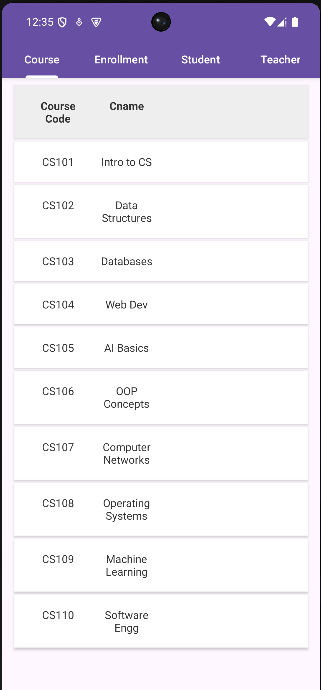
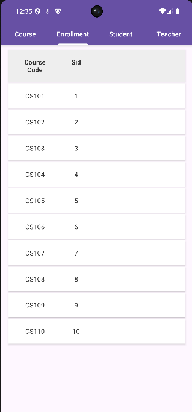
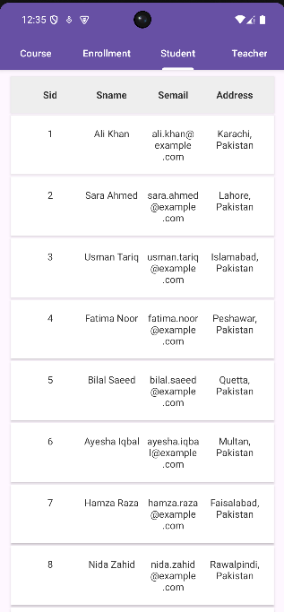
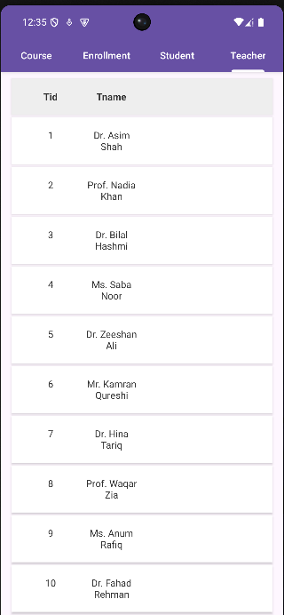

# Lecture #10: Android Backend Connectivity with RecyclerView

This lecture demonstrates how to connect an Android application with a backend API and display data using RecyclerView. The example shows how to fetch teacher data from our Node.js backend and display it in a list format.

## Project Structure

### 1. ConnectivityOfBackend
Main lecture code demonstrating:
- API connectivity using Volley
- RecyclerView implementation
- JSON data parsing
- Adapter pattern implementation

### 2. Assignment2
Assignment task: Create an app that displays data from all database tables using:
- Navigation bar
- Dynamic fragments
- RecyclerView for data display
- Backend API connectivity

#### Assignment2 App Screenshots

Here are the screenshots of the completed Assignment2 app showing different data tables:

1. **Splash Screen**
   

2. **Course Table**
   

3. **Enrollment Table**
   

4. **Student Table**
   

5. **Teacher Table**
   

The app demonstrates:
- Navigation bar for switching between tables
- Clean table layout for data display
- Proper data formatting
- Responsive design

## Implementation Details

### Main Components

1. **MainActivity.java**
   - Handles API requests using Volley
   - Manages RecyclerView setup
   - Parses JSON response from backend
   - Updates UI with received data

2. **TeacherAdapter.java**
   - Custom RecyclerView adapter
   - Manages view recycling
   - Binds teacher data to views
   - Handles list item layouts

3. **Teacher.java**
   - Model class for teacher data
   - Stores teacher ID and name

### Key Features

1. **Backend Connectivity**
   - Uses Volley library for API requests
   - Handles asynchronous data loading
   - Implements error handling
   - Parses JSON responses

2. **RecyclerView Implementation**
   - Efficient list rendering
   - View recycling for better performance
   - Custom adapter implementation
   - List item layout management

## Setup Instructions

1. Add Volley dependency in `build.gradle`:
```gradle
implementation 'com.android.volley:volley:1.2.1'
```

2. Add Internet permission in `AndroidManifest.xml`:
```xml
<uses-permission android:name="android.permission.INTERNET" />
```

3. Update backend URL in `MainActivity.java`:
```java
private final String url = "your_backend_url/teacher";
```

## Assignment Requirements

Create an Android application that:
1. Implements a navigation bar
2. Uses dynamic fragments for different screens
3. Displays data from all database tables:
   - Teachers
   - Students
   - Courses
   - Enrollments
   - Teaching assignments
4. Uses RecyclerView for data display
5. Connects to the backend API
6. Implements proper error handling

## Best Practices

1. **Code Organization**
   - Follow MVVM architecture
   - Separate concerns (data, UI, logic)
   - Use meaningful variable names
   - Add proper comments

2. **UI/UX**
   - Implement loading indicators
   - Handle error states gracefully
   - Follow Material Design guidelines
   - Ensure responsive layout

3. **Performance**
   - Use ViewHolder pattern
   - Implement efficient data binding
   - Handle configuration changes
   - Cache network responses

## Resources

- [Android Volley Documentation](https://google.github.io/volley/)
- [RecyclerView Guide](https://developer.android.com/guide/topics/ui/layout/recyclerview)
- [Navigation Component](https://developer.android.com/guide/navigation)
- [Fragments Guide](https://developer.android.com/guide/fragments) 