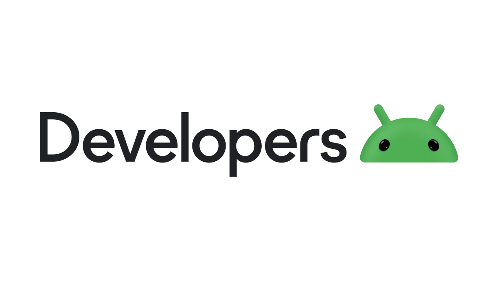

# Java Android Development Lectures

<div align="center">
  
  <h3>Abdul Samad</h3>
  <p>Software Developer</p>
</div>

Hi, I'm Abdul Samad, a Software Developer. I created this repository to document my learning journey in the Mobile Application Development course at SMIU during the Spring 2025 term (6th semester). 

Sir Abid is our course instructor, and his teaching method is very classy and effective. This repository serves as my personal learning resource and practice area, while also contributing to the open source community.

## Android Development Showcase

<div align="center">
  
  
</div>

## Repository Structure

Each lecture is organized in its own folder with the following structure:

```
Lecture#X/
├── README.md (lecture overview and exercises)
├── Notes.pdf (lecture slides and detailed notes)
├── SampleCode/ (example code demonstrated in class)
└── Assignments/ (homework and practical tasks)
```

## Prerequisites

- Basic programming knowledge
- Java Development Kit (JDK) installed
- Android Studio installed

## Course Outline

- **Lecture #1: Introduction to Java and Android Development**  &nbsp;&nbsp;&nbsp;  *1st March, 2025*
- **Lecture #2: Android Architecture and UI Layouts**  &nbsp;&nbsp;&nbsp;  *8th March, 2025*
- **Lecture #3: Android UI Components and Event Handling**  &nbsp;&nbsp;&nbsp;  *15th March, 2025*
- **Lecture #4: UI Design and Layouts**  &nbsp;&nbsp;&nbsp;  *22nd March, 2025*
- **Lecture #5: Activities and Intents**  &nbsp;&nbsp;&nbsp;  *29th March, 2025*
- **Lecture #6: Fragments and Navigation**  &nbsp;&nbsp;&nbsp;  *5th April, 2025*
- **Lecture #7: RecyclerView and Adapters**  &nbsp;&nbsp;&nbsp;  *26th April, 2025*
- **Lecture #8: Data Storage Options**  &nbsp;&nbsp;&nbsp;  *3rd May, 2025*
- **Lecture #9: Networking and APIs**  &nbsp;&nbsp;&nbsp;  *10th May, 2025*
- **Lecture #10: Background Processing**
- **Lecture #11: Location and Maps**
- **Lecture #12: Publishing and Monetization**

## Getting Started

1. Clone this repository
   ```
   git clone https://github.com/itxsamad1/Java-Android-Dev-Lectures.git
   ```

2. Install required software
   - Install [JDK 17 or later](https://www.oracle.com/java/technologies/downloads/)
   - Install [Android Studio](https://developer.android.com/studio)

3. Set up environment variables
   - **JAVA_HOME**: Points to your JDK installation directory
     ```
     # Windows example
     JAVA_HOME=C:\Program Files\Java\jdk-17
     
     # macOS/Linux example
     export JAVA_HOME=/usr/lib/jvm/java-17-openjdk
     ```
   
   - **ANDROID_HOME**: Points to your Android SDK location
     ```
     # Windows example
     ANDROID_HOME=C:\Users\YourUsername\AppData\Local\Android\Sdk
     
     # macOS example
     export ANDROID_HOME=~/Library/Android/sdk
     
     # Linux example
     export ANDROID_HOME=~/Android/Sdk
     ```
   
   - Add platform tools to your PATH
     ```
     # Windows - add to PATH environment variable
     %ANDROID_HOME%\platform-tools
     
     # macOS/Linux - add to .bash_profile or .zshrc
     export PATH=$PATH:$ANDROID_HOME/platform-tools
     ```

4. Navigate to each lecture folder as we progress through the course

## Running Android Apps

### Using the Emulator
1. Open the project in Android Studio
2. Click on "AVD Manager" in the toolbar
3. Create a new virtual device if none exists
4. Select your virtual device and click "Start"
5. Run the app by clicking the green "Run" button

### Using a Physical Android Device
1. Enable "Developer options" on your Android device
   - Go to Settings > About phone
   - Tap "Build number" 7 times
   - Return to Settings > System > Developer options
   - Enable "USB debugging"

2. Connect your device via USB
   - Allow USB debugging when prompted on your device
   - Make sure your computer recognizes the device

3. Run the app from Android Studio
   - Select your device from the dropdown menu
   - Click the green "Run" button

## Contributing

This repository is primarily for educational purposes. If you find errors or have suggestions for improvements, please open an issue.
